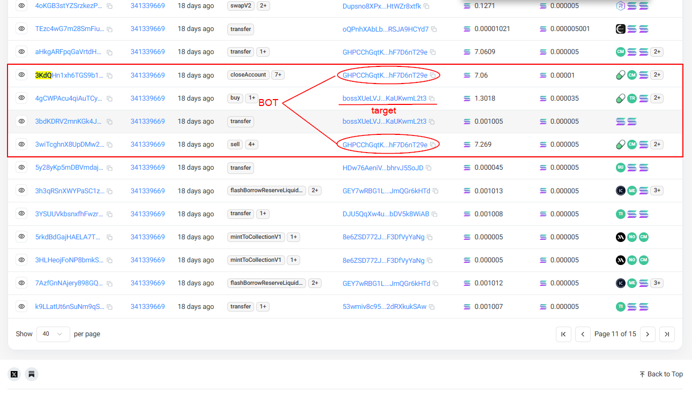
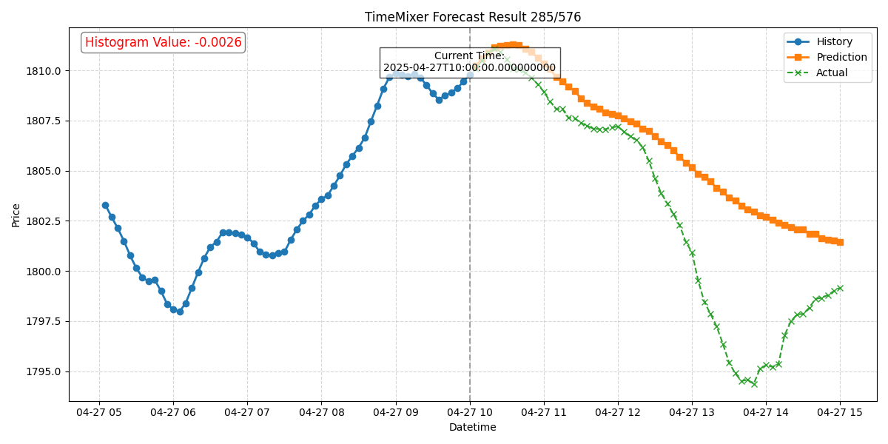
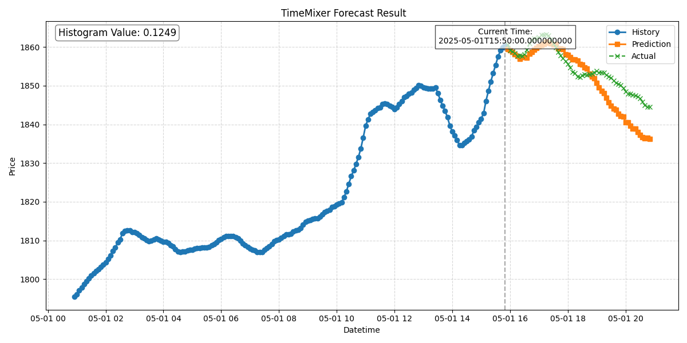
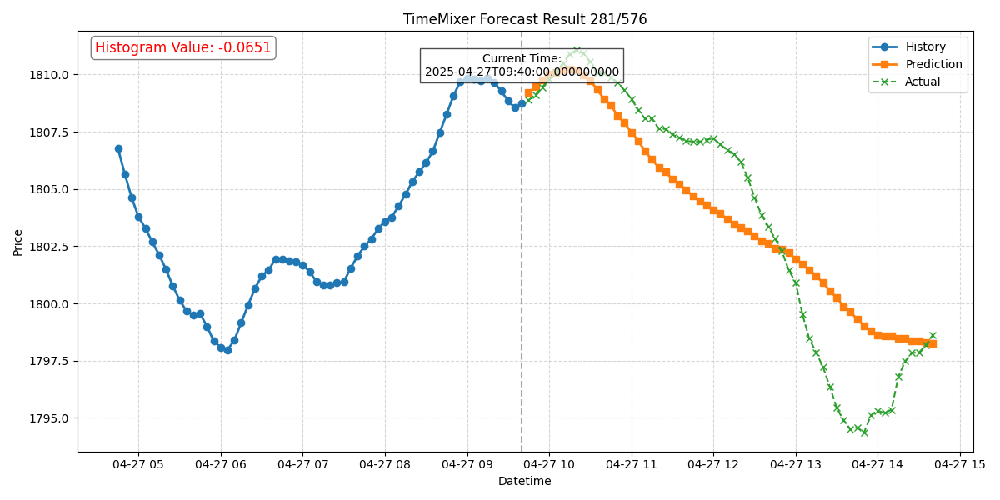

# Stock Trading bot using AI LLM Forecasting Model

## Overview

**AI-powered** **stock** **trading bot** leverages the **TimeMixer model**—a hybrid **LSTM**-attention architecture—to **forecast** price movements with high accuracy. By analyzing historical OHLCV data and market trends, the bot generates low-latency trading signals for intraday or swing strategies. The TimeMixer's ability to capture long-term dependencies and key temporal patterns makes it ideal for volatile equity markets. Integrated with broker APIs, the system executes trades autonomously while managing risk through dynamic stop-loss and position sizing.

[Medium](https://medium.com/@fenrow325/stock-trading-forecasting-model-3819e1b792c9)

## Let's Connect!,

<a href="mailto:fenrow325@gmail.com" target="_blank">
  
</a>
<a href="https://t.me/fenrow" target="_blank">
  
</a>
<a href="https://discord.com/users/fenrow_325" target="_blank">
  
</a>

## Model Output

Trained on 2019-2021 stock data, tested on 2022 with a profit of $480.45:



You can obtain similar visualizations of your model evaluations using the [notebook](./visualize.ipynb) provided.

## Table of contents
  * [Models](#models)
  * [Dataset](#dataset)
  * [Ranking](#Ranking-in-2024)
  * [Getting Started](#Getting-Started)
  * [Results](#results)

## contents

### Models

 1. LSTM
 2. LSTM Bidirectional
 3. LSTM 2-Path
 4. GRU
 5. GRU Bidirectional
 6. GRU 2-Path
 7. Vanilla
 8. Vanilla Bidirectional
 9. Vanilla 2-Path
 10. LSTM Seq2seq
 11. LSTM Bidirectional Seq2seq
 12. LSTM Seq2seq VAE
 13. GRU Seq2seq
 14. GRU Bidirectional Seq2seq
 15. GRU Seq2seq VAE
 16. Attention-is-all-you-Need
 17. CNN-Seq2seq
 18. Dilated-CNN-Seq2seq

You can check the **Deep-learning models** [here](deep-learning)

### Dataset

You can download Historical Financial data from [here](https://ca.finance.yahoo.com/) for training, or even use some sample datasets already present under `data/`.

### Ranking in 2024
1. TimeGPT ranking 1 (paid)
2. TimeFM ranking 2 (open source)
3. Chronos ranking 3 (open source)

You can check the model Ranking [here](https://arxiv.org/abs/2410.16032)

## Getting Started

In order to use this project, you'll need to install the required python packages:

```bash
pip3 install -r requirements.txt
```

Now you can open up a terminal and start training the agent:

```bash
python3 train.py data/GOOG.csv data/GOOG_2018.csv --strategy t-dqn
```

Once you're done training, run the evaluation script and let the agent make trading decisions:

```bash
python3 eval.py data/GOOG_2019.csv --model-name model_GOOG_50 --debug
```

Now you are all set up!

## Results







---

## 📞 Contact Information
For questions, feedback, or collaboration opportunities, feel free to reach out:

<div align="left">

📧 **Email**: [fenrow325@gmail.com](mailto:fenrow325@gmail.com)  
📱 **Telegram**: [@fenroW](https://t.me/fenrow)  
🎮 **Discord**: [@fenroW](https://discord.com/users/fenrow_325)  

</div>

---